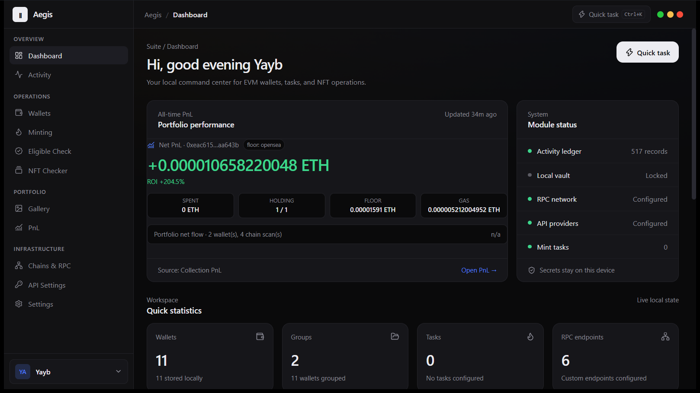
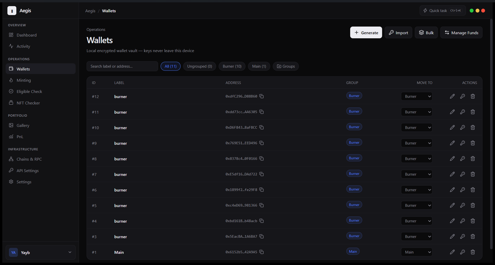
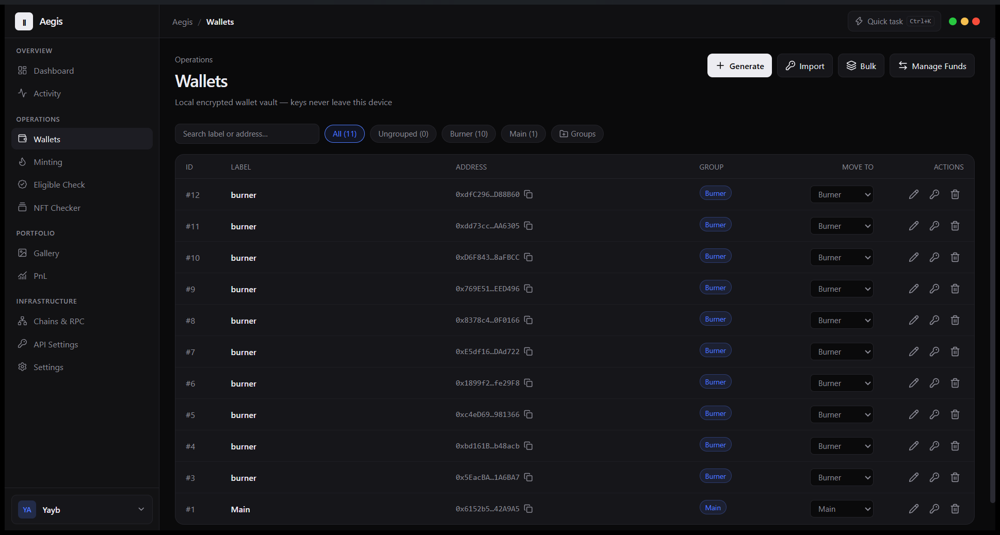
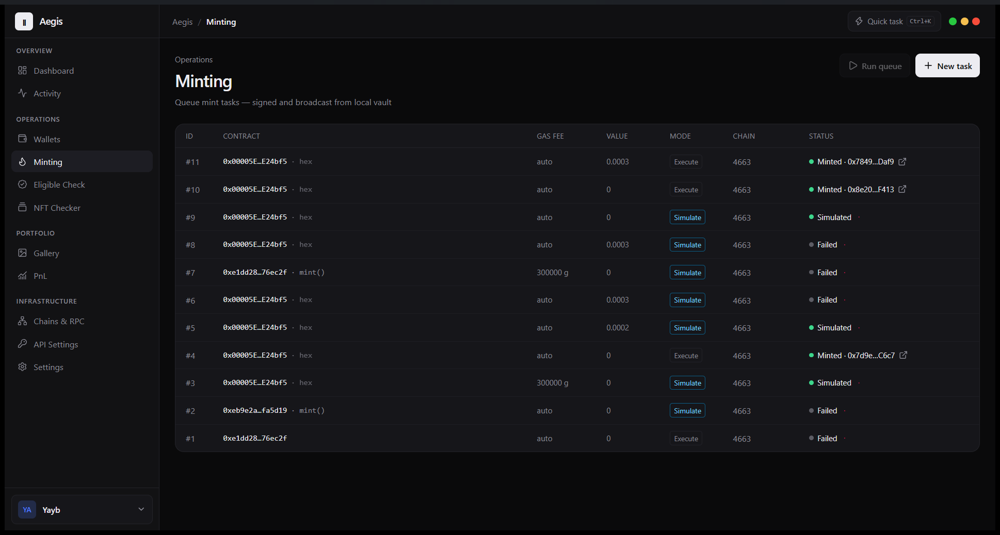
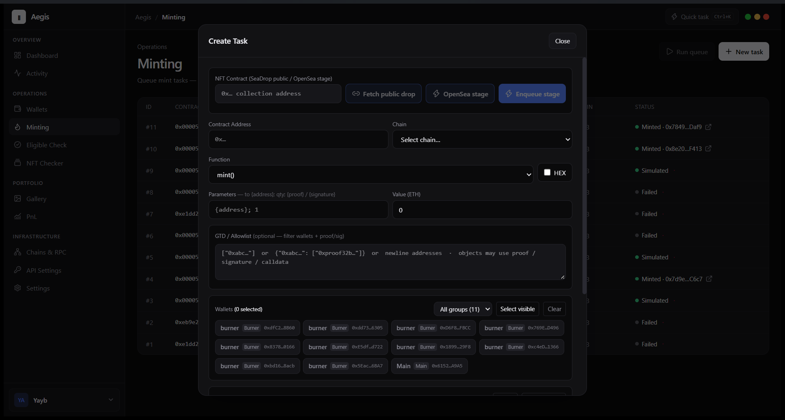
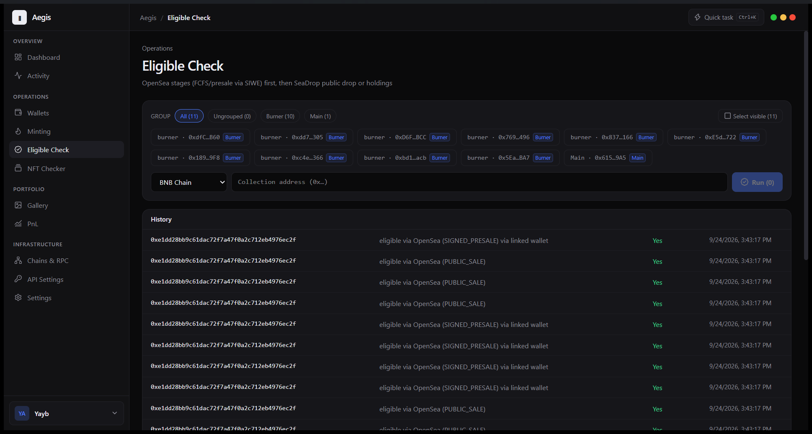
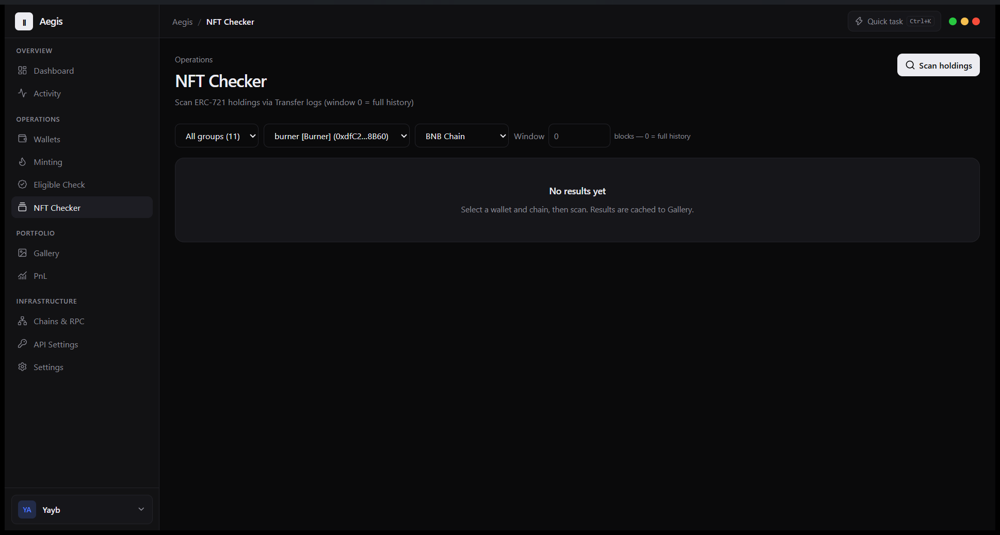
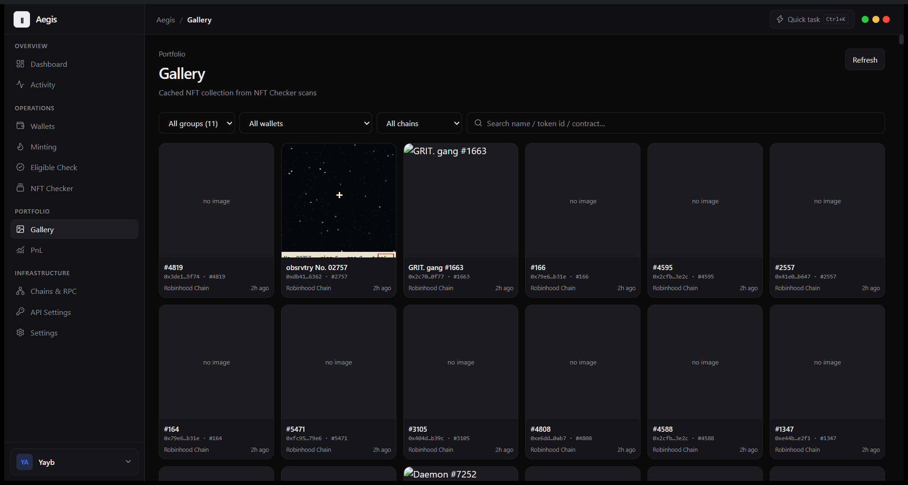
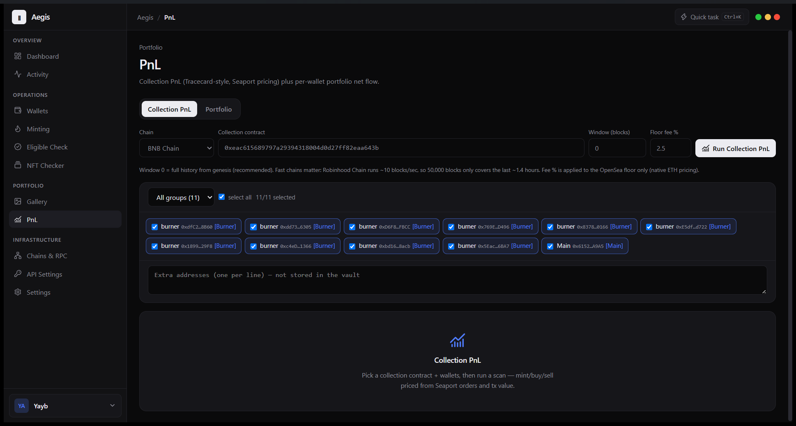
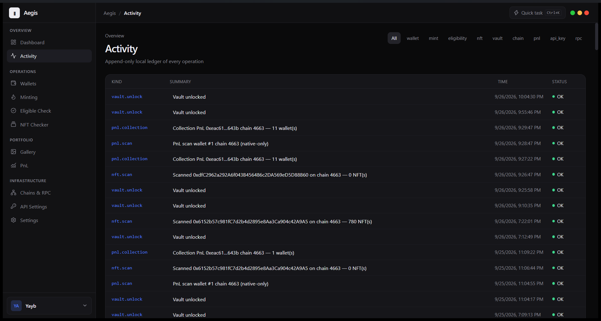

# Aegis

Dark Web3 / EVM command center — Tauri 2 + React + TypeScript + Tailwind + SQLite.

Local encrypted wallet vault (Argon2id + AES-256-GCM), multi-wallet fleet, mint queue, NFT scanner, OpenSea eligibility checks, collection PnL, and multi-chain RPC — all keys and data stay on your device.



## Features

### Dashboard

At-a-glance portfolio performance panel fed by real scans: net PnL (ETH), ROI %, latest collection scan (floor source, price, wallet/chain coverage), net flow across wallets, and last-updated time — plus chain activity shortcuts.


### Wallets

Local encrypted vault — generate, import, and bulk-create wallets, organize them into groups (Burner / Main), copy addresses, and edit labels. Keys never leave the device.

- **Manage Funds**: transfer / deposit / withdraw between chains and contracts from one modal.





### Minting

Queue of mint tasks signed and broadcast from the local vault. Track per-task gas mode (auto / gas limit), value, chain, and live status (Simulated / Minted with tx link / Failed), then run the whole queue.

- **Create Task** (modal): SeaDrop public drop / OpenSea stage helpers, contract + chain, function selector with raw HEX mode, parameters, value, GTD / allowlist proof-or-signature filter, and multi-wallet selection.





### Eligible Check

Check drop eligibility across the whole wallet fleet at once: OpenSea stages (FCFS / presale via SIWE) first, then SeaDrop public drop or holdings. Filter by group, pick wallets, point at a collection contract, and review a persistent history of results.



### NFT Checker

Scan ERC-721 holdings per wallet + chain via `Transfer` log queries with adaptive block ranges. **Window `0` = full history from genesis.** Results are cached to the Gallery with collection metadata, token images, and **OpenSea links**.



### Gallery

Cached NFT collection from NFT Checker scans — filter by group / wallet / chain, search by name, token id, or contract, and jump to the OpenSea asset page from any card.



### PnL

Two views:

- **Collection PnL** — Tracecard-style mint/buy/sell accounting for one collection across selected wallets, priced from Seaport orders and tx value, with OpenSea floor pricing and configurable fee %. Window `0` = full history.
- **Portfolio** — per-wallet native net flow over a block window with persisted scan history.

Feeds the Dashboard's portfolio performance panel.



### Activity

Append-only local ledger of every operation — wallet, mint, eligibility, NFT, vault, chain, PnL, API key, and RPC events with time and status, filterable by kind.



### Chains & RPC / API Settings / Settings

Manage custom chains and RPC endpoints, third-party API keys (e.g. OpenSea), and app preferences.

## Develop

```bash
npm install
npm run tauri dev
```

## Build

```bash
npm run tauri build
```

Installers land in `src-tauri/target/release/bundle/`.

## Stack

- Frontend: React 19, Vite, Tailwind v4, zustand
- Backend: Tauri 2 (Rust), rusqlite, alloy, argon2, aes-gcm
- Secrets never leave the device
